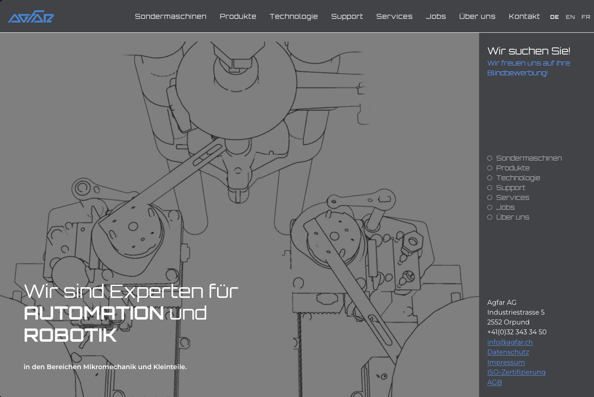

---
tags:
- concept
- design
- development

tooling:
- figma
- relume
- webflow

year: 
- 2024
- 2025

link: https://www.agfar.ch

cta:
  text: "special machine from biel"
  button: "I want to see that!"
  link: https://www.agfar.ch
---

# Agfar AG

For AGFAR (AG for Automation and Robotics) I had the privilege to design and implement a new web presence.

The technical DNA of the company should be visible on the website.

The greatest difficulty turned out to be structuring the many complex contents on the website in such a way that they are found, but also understood.

