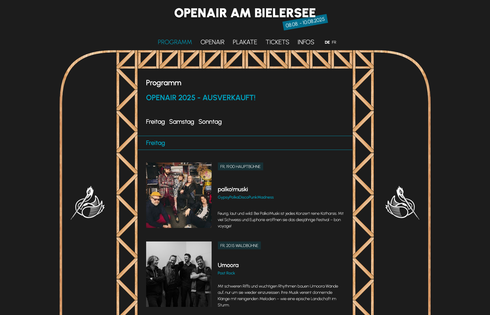
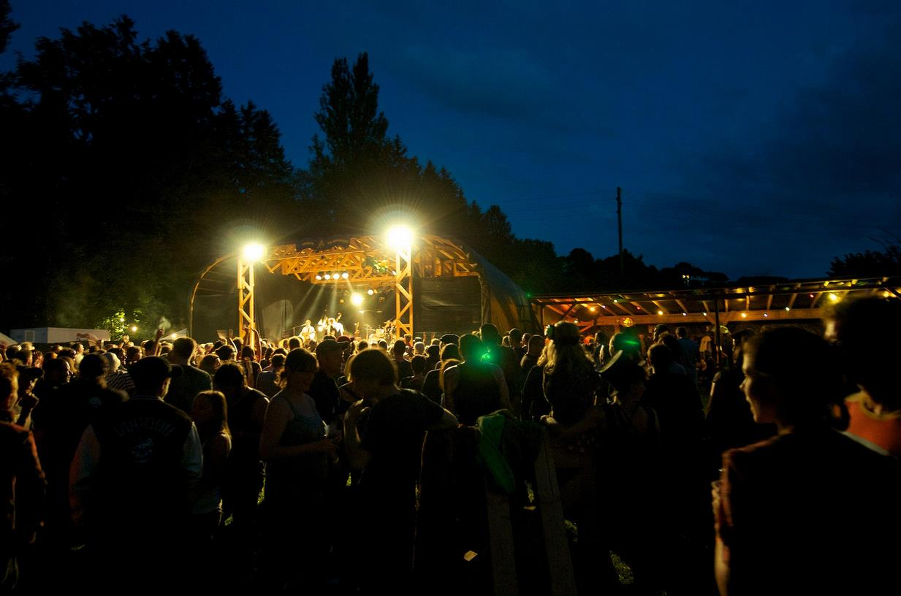

---
tags:
- concept
- design
- illustration
- development

technologies / tools:
- figma
- affinity designer
- kirby cms

year: 
- 2025

link: https://www.openairambielersee.ch

cta:
  text: "the website in full splendor!"
  button: "I want to see that!"
  link: https://www.openairambielersee.ch
---

# Openair am Bielersee

The somewhat different website - for the somewhat different openair festival.

The Openair am Bielersee is deliberately different:

- Stage made of wood
- Actually everything made of wood
- No sponsors
- Family atmosphere

For over 30 years, this somewhat different openair has thrilled its visitors and is regularly sold out.

We wanted to implement this spirit as a website. Thus the idea was born to give the website a stage.

This is what the openair looks like in real life!

